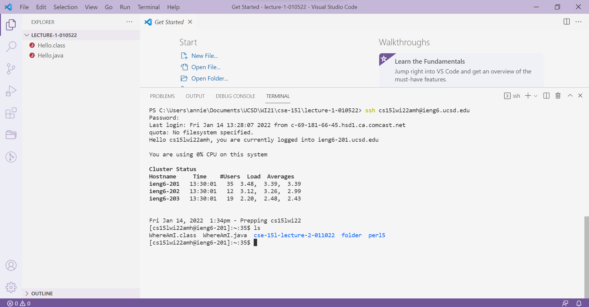
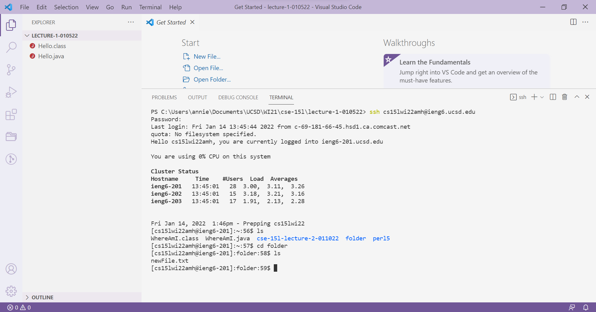
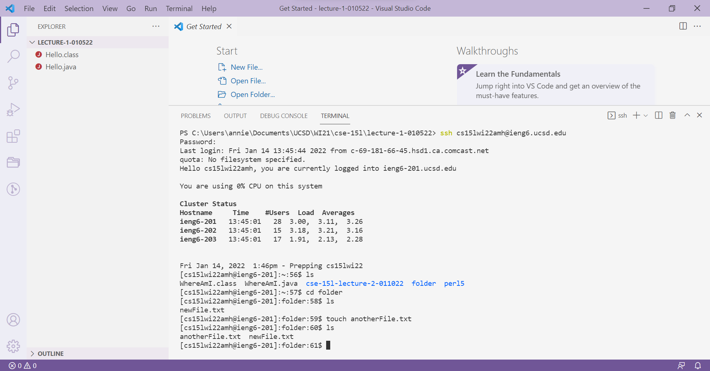
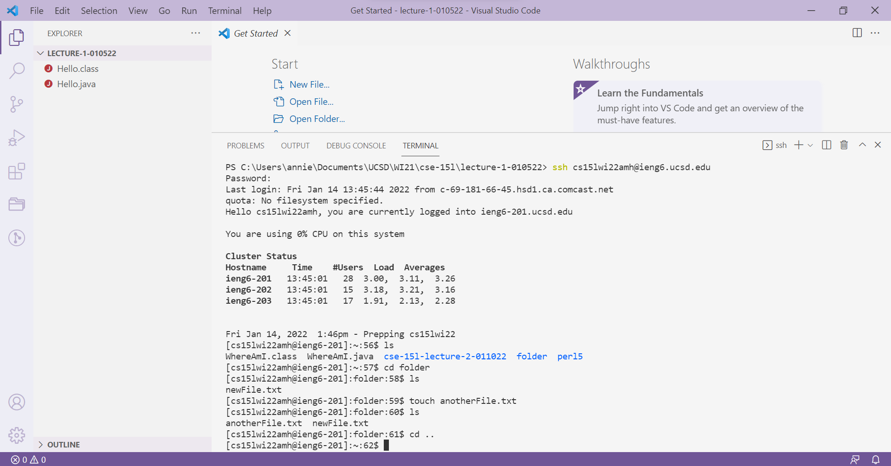

# Week 2 - Lab Report
> ## ***TUTORIAL ON REMOTE ACCESS***
#### In this lab, you will learn how to log into your course-specific account on `ieng6`.
---
### **Setting Up**
1. The first step is to open up Visual Studio Code. If you do not have VSCode downloaded, you can download it from [this link](https://code.visualstudio.com/). You're VSCode should look like this when you first open it:

2. Next, go to your desired directory by clicking *File > Open Folder*:

3. Now, let's try remotely connecting to our `ieng6` accounts. Create a new terminal by clicking *Terminal > New Terminal*:


### **Remotely Connecting**
1. First, you want to ensure that you have OpenSSH. Follow [this link](https://docs.microsoft.com/en-us/windows-server/administration/openssh/openssh_install_firstuse) to do so. I did not need to do this step, as OpenSSH was already on my laptop.
2. Next, find your course-specific account email from [this link](https://sdacs.ucsd.edu/~icc/index.php). Your password should be your TritonLink password, but you can follow instructions to change that. Store your account email and password somewhere readily accessible.
3. Go back to the new terminal you opened in VSCode and enter the following command: 
```ssh <account email>```.

4. You will be prompted to enter your password. Note that when you type it in, you won't see anything appearing on the screen until you press enter.


### **Trying Some Commands**
Once we are in the server, notice how our prompt in the terminal is different from before. Let's try to run some commands:
1. `ls` lists out all the files in the directory. Notice how files from our client/remote directory are not listed (e.g. Hello.java, Hello.class).

2. Let's get into `folder`, one of the directories listed, with the `cd <directory>` command. Notice how the prompt changes. When we run `ls` again, we can see that one file already exists in folder.

3. `touch <new filename>` creates a new file in the current directory. If we run `ls`, we can see the new file we created.

4. Let's get out of the `folder` directory with the command `cd ..`. To get out of the SSH server, enter `exit` into the terminal. Notice how the prompt changes back to what we had earlier.


### **Moving Files over `SSH` with `scp`**
1. Enter `scp <filename> <account email>`to copy a file from our client into our `ssh accounts.