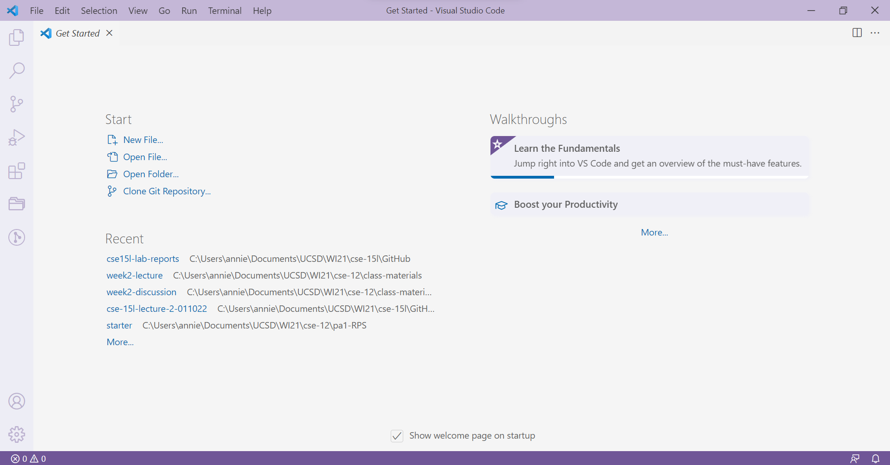
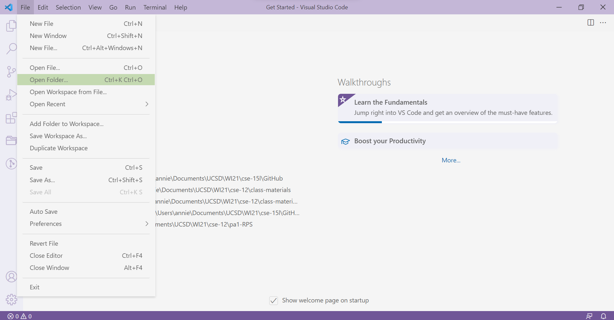
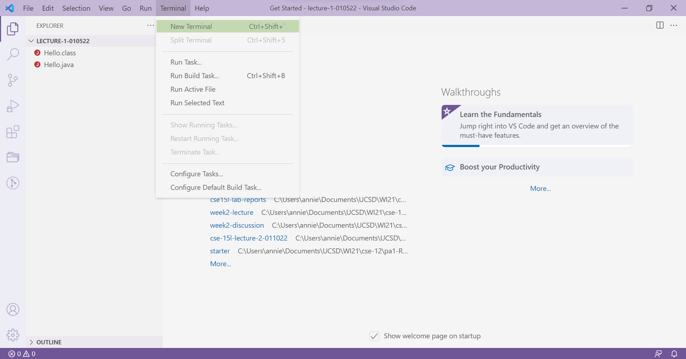
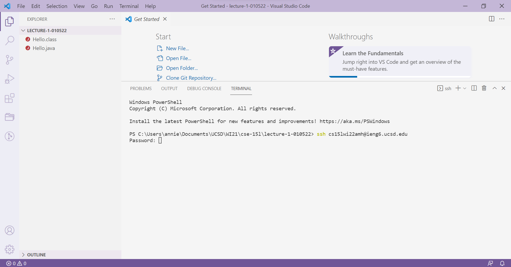
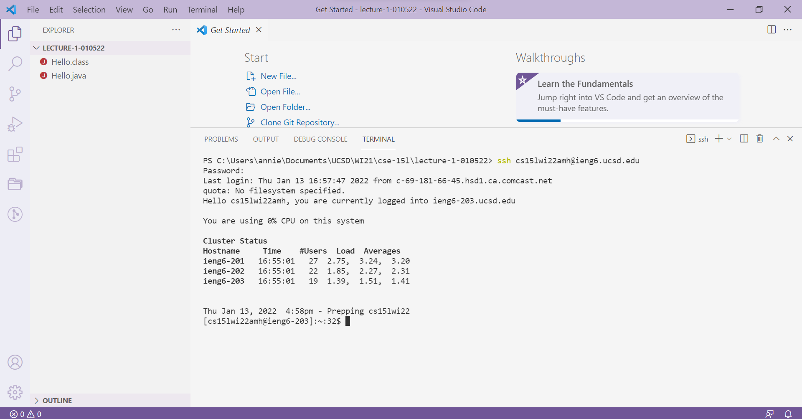

# Week 2 - Lab Report
> ## ***TUTORIAL ON REMOTE ACCESS***
#### In this lab, you will learn how to log into your course-specific account on `ieng6`.
---
### **Setting Up**
1) The first step is to open up Visual Studio Code. If you do not have VSCode downloaded, you can download it from [this link](https://code.visualstudio.com/). You're VSCode should look like this when you first open it:

2) Next, go to your desired directory by clicking *File > Open Folder*:

3) Now, let's try remotely connecting to our `ieng6` accounts. Create a new terminal by clicking *Terminal > New Terminal*:


### **Remotely Connecting**
1) First, you want to ensure that you have OpenSSH. Follow [this link](https://docs.microsoft.com/en-us/windows-server/administration/openssh/openssh_install_firstuse) to do so. I did not need to do this step, as OpenSSH was already on my laptop.
2) Next, find your course-specific account email from [this link](https://sdacs.ucsd.edu/~icc/index.php). Your password should be your TritonLink password, but you can follow instructions to change that. Store your account email and password somewhere readily accessible.
3) Go back to the new terminal you opened in VSCode and enter the following command: 
```ssh <account email>```.

4) You will be prompted to enter your password. Note that when you type it in, you won't see anything appearing on the screen until you press enter.
