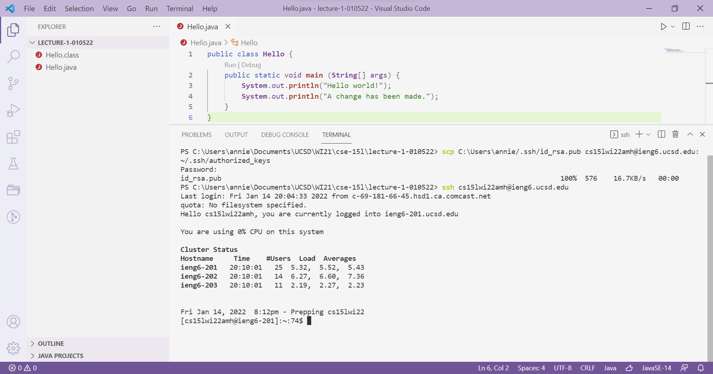

# Week 2 - Lab Report
> ## ***TUTORIAL ON REMOTE ACCESS***
#### In this lab, you will learn how to log into your course-specific account on `ieng6`.
---
### **Setting Up**
1. The first step is to open up Visual Studio Code. If you do not have VSCode downloaded, you can download it from [this link](https://code.visualstudio.com/). You're VSCode should look like this when you first open it:

2. Next, go to your desired directory by clicking *File > Open Folder*:

3. Now, let's try remotely connecting to our `ieng6` accounts. Create a new terminal by clicking *Terminal > New Terminal*:


### **Remotely Connecting**
1. First, you want to ensure that you have OpenSSH. Follow [this link](https://docs.microsoft.com/en-us/windows-server/administration/openssh/openssh_install_firstuse) to do so. I did not need to do this step, as OpenSSH was already on my laptop.
2. Next, find your course-specific account email from [this link](https://sdacs.ucsd.edu/~icc/index.php). Your password should be your TritonLink password, but you can follow instructions to change that. Store your account email and password somewhere readily accessible.
3. Go back to the new terminal you opened in VSCode and enter the following command: 
```ssh <account email>```.

4. You will be prompted to enter your password. Note that when you type it in, you won't see anything appearing on the screen until you press enter.


### **Trying Some Commands**
Once we are in the server, notice how our prompt in the terminal is different from before. Let's try to run some commands:
1. `ls` lists out all the files in the directory. Notice how files from our client/remote directory are not listed (e.g. Hello.java, Hello.class).

2. Let's get into `folder`, one of the directories listed, with the `cd <directory>` command. Notice how the prompt changes. When we run `ls` again, we can see that one file already exists in folder.

3. `touch <new filename>` creates a new file in the current directory. If we run `ls`, we can see the new file we created.

4. Let's get out of the `folder` directory with the command `cd ..`. To get out of the SSH server, enter `exit` into the terminal. Notice how the prompt changes back to what we had earlier.


### **Moving Files Over `SSH` With `scp`**
1. Let's first run a file from our client to see what it will output.

2. Let's make a change to this file and copy this file into our `ssh` accounts. Enter `scp <filename> <account email>:~/` to do so. You will be prompted to enter your password in order to complete this step.

3. Now, let's go back to our server and check whether the copied file is in our `ssh` accounts. 

4. Run the copied file in the server. The change we made in step 2 should be reflected.


### **Setting an `SSH` Key**
The process of making a change to a file, saving it, copying it to a server, and then checking if all of those actions were successful would take a long time. We can set up `ssh` keys to speed up this process by eliminating the step of typing our password.
1. Exit out of your `ssh` accounts. On your client server. Enter the command `ssh-keygen`.

2. You will be prompted to enter where to save the key. Enter whatever directory is in the parentheses.Afterwards, you will be prompted to enter a passphrase. We can skip this step by just pressing enter.

3. Your computer's `.ssh` directory should now contain the private (`id_rsa`) and public key (`id_rsa.pub`). The next step is to copy the public key into the `.ssh` directory in your server. You can do this by entering the following: `scp <directory of public key> <account email>:~/.ssh/authorized_keys`. You will then be prompted to enter your password.

4. Now, you should be able to move and copy files into your server without the need to type your password. Let's try going into our server now. Notice how you no longer are prompted to enter your password.


### **Optimizing Remote Running**
With the usage of `ssh` keys, we can now simplify the process of copying a file from client to server and running it in the server.

Let's make a change to our file in our client. Note that we can separate commands with semicolons and complete a command in the server by putting it in quotes after your `ssh` commands.

To copy a file from client to server, we can type the following command on one line.
```
scp Hello.java cs15lwi22amh@ieng6.ucsd.edu:~/; ssh cs15lwi22amh@ieng6.ucsd.edu "javac Hello.java; java Hello"
```
Your result should reflect the change you made remotely.
