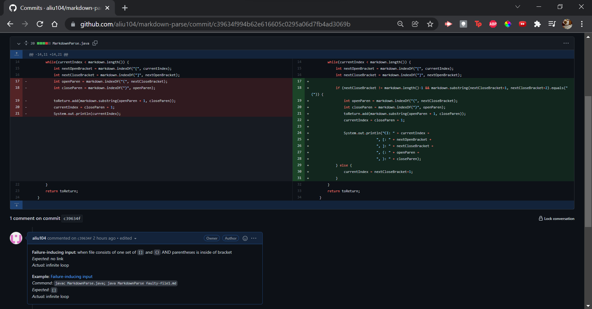
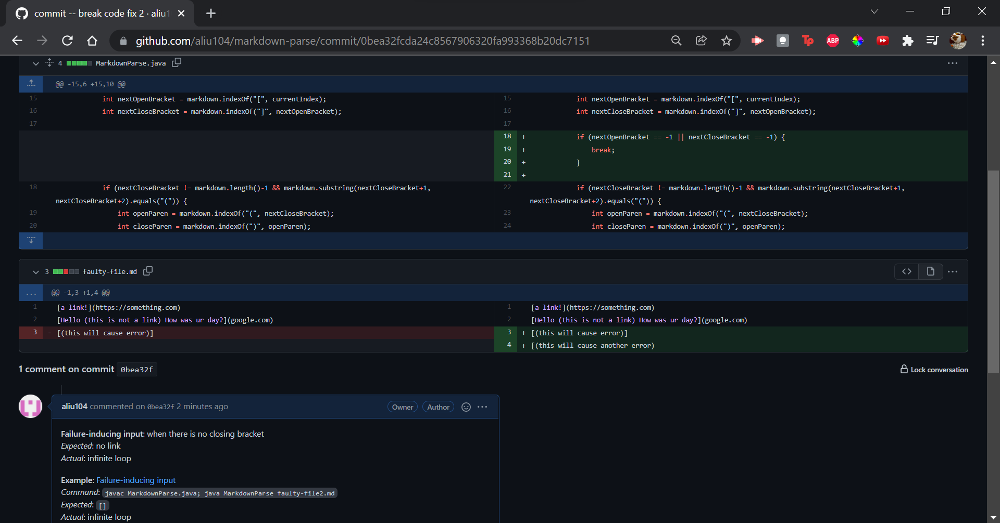
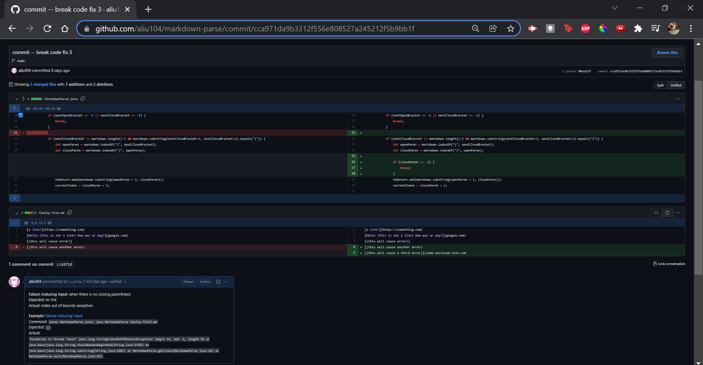

# Week 4 - Lab Report 2
## ***FIXING BUGS IN A PROGRAM***

#### In this lab, you will see 3 code changes in `markdown-parse` to learn more about bugs, symptoms, and failure-inducing inputs.
---
### **Code Change #1**

- [Link to failure-inducing input](https://github.com/aliu104/markdown-parse/blob/main/faulty-file1.md)
- Program symptom:
```
PS C:\Users\annie\Documents\UCSD\WI21\cse-15l\GitHub\markdown-parse> javac MarkdownParse.java
PS C:\Users\annie\Documents\UCSD\WI21\cse-15l\GitHub\markdown-parse> java MarkdownParse faulty-file1.md
```
- Write 2-3 sentences describing the relationship between the bug, the symptom, and the failure-inducing input.

--
### **Code Change #2**

- [Link to failure-inducing input](https://github.com/aliu104/markdown-parse/blob/main/faulty-file2.md)
- Program symptom:
```
PS C:\Users\annie\Documents\UCSD\WI21\cse-15l\GitHub\markdown-parse> javac MarkdownParse.java
PS C:\Users\annie\Documents\UCSD\WI21\cse-15l\GitHub\markdown-parse> java MarkdownParse faulty-file1.md
```
- Write 2-3 sentences describing the relationship between the bug, the symptom, and the failure-inducing input.

--
### **Code Change #3**

- [Link to failure-inducing input](https://github.com/aliu104/markdown-parse/blob/main/faulty-file3.md)
- Program symptom:
```
PS C:\Users\annie\Documents\UCSD\WI21\cse-15l\GitHub\markdown-parse> javac MarkdownParse.java
PS C:\Users\annie\Documents\UCSD\WI21\cse-15l\GitHub\markdown-parse> java MarkdownParse faulty-file3.md 
Exception in thread "main" java.lang.StringIndexOutOfBoundsException: begin 34, end -1, length 56
        at java.base/java.lang.String.checkBoundsBeginEnd(String.java:3756)
        at java.base/java.lang.String.substring(String.java:1902)
        at MarkdownParse.getLinks(MarkdownParse.java:26)
        at MarkdownParse.main(MarkdownParse.java:43)
PS C:\Users\annie\Documents\UCSD\WI21\cse-15l\GitHub\markdown-parse>
```
- Write 2-3 sentences describing the relationship between the bug, the symptom, and the failure-inducing input.