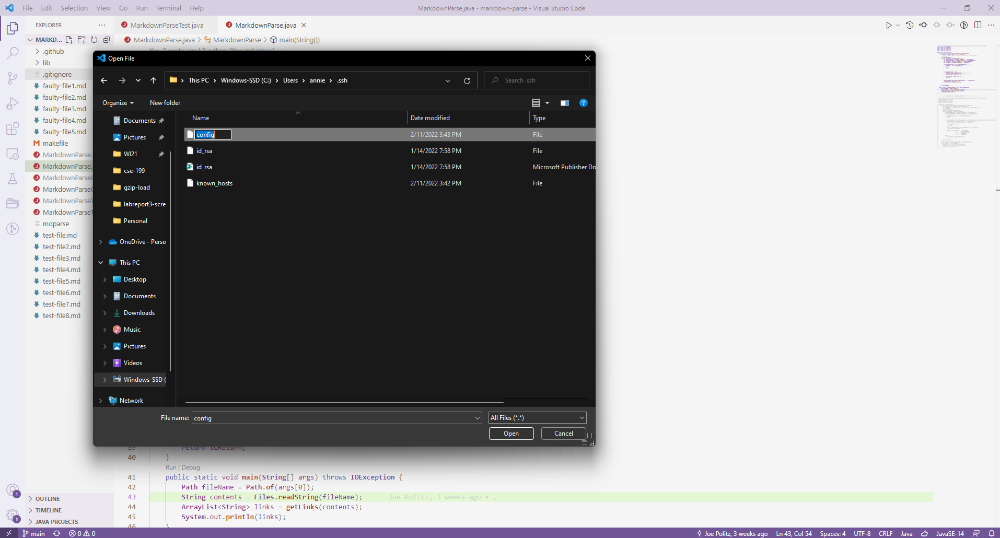
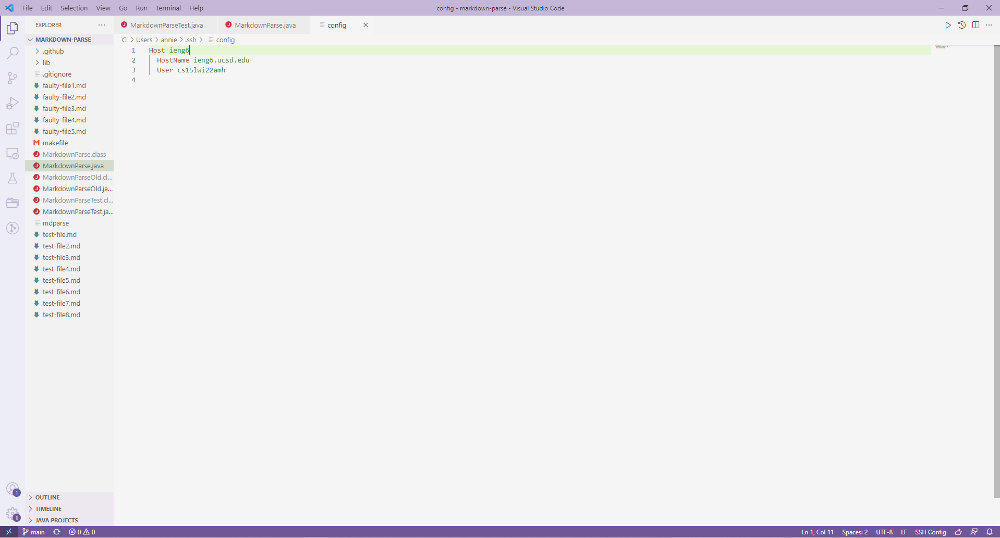
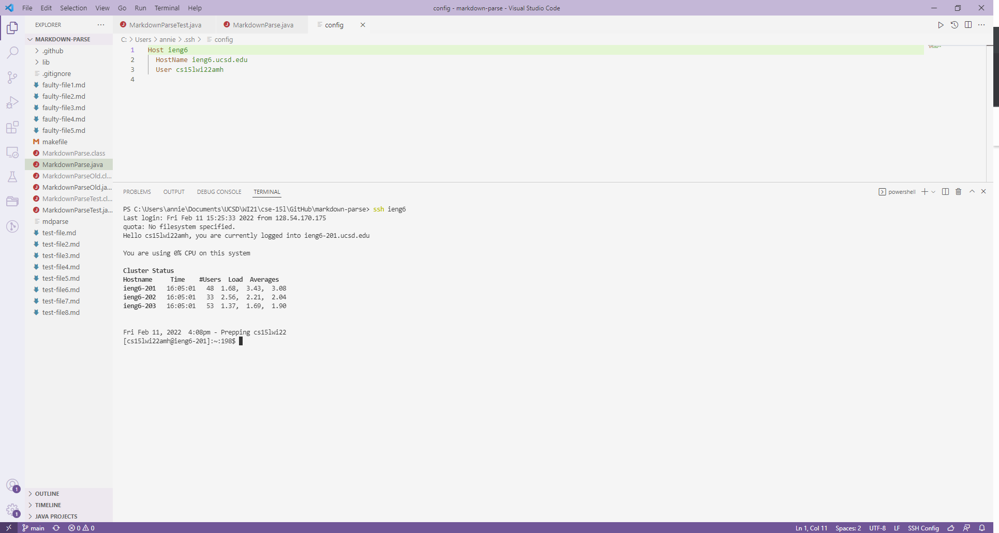
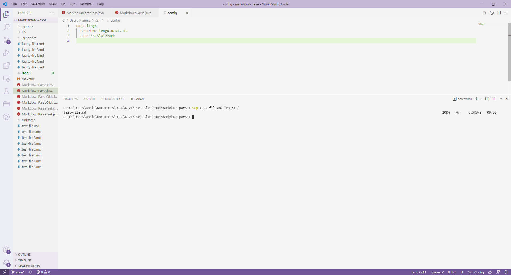
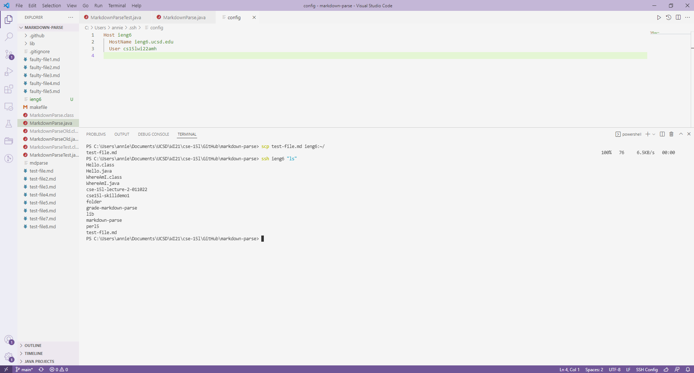
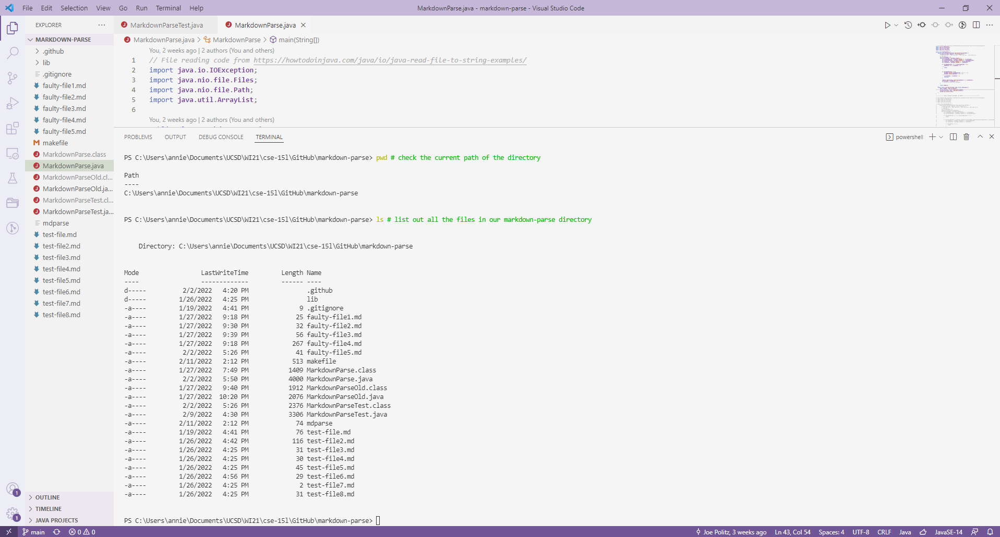
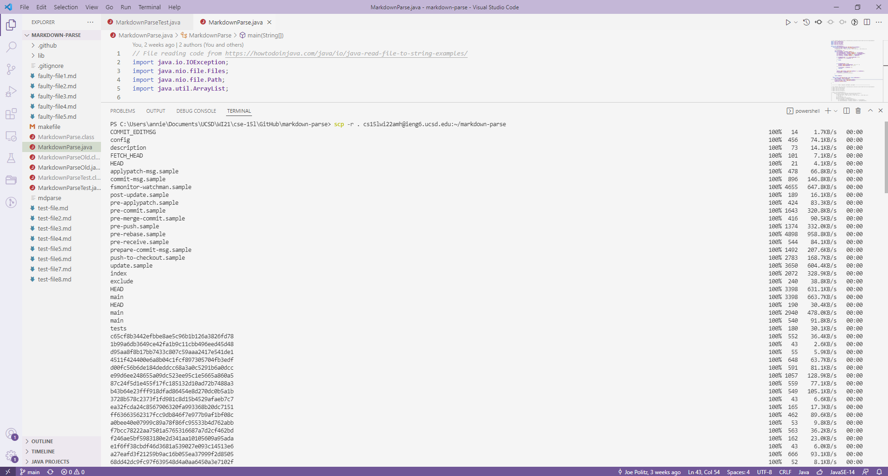
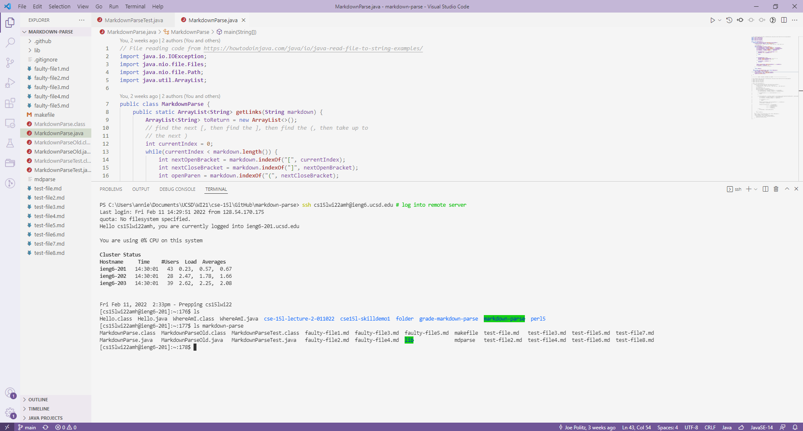
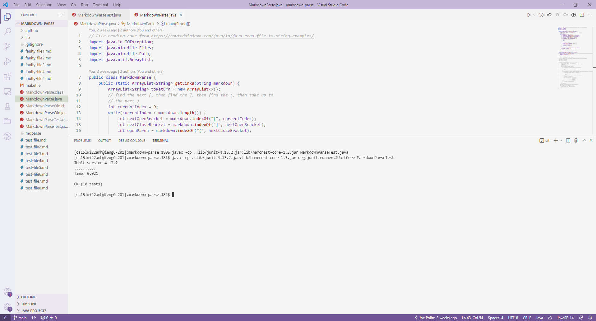
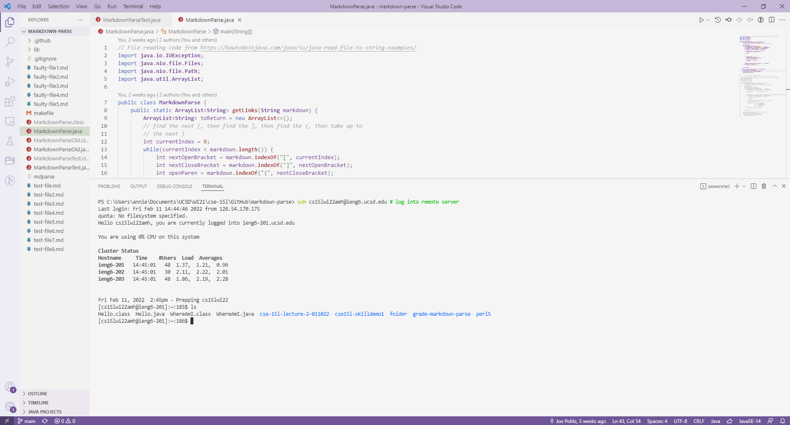

# Week 6 - Lab Report 3
## ***STREAMLINE `SSH` CONFIGURATION***

#### In this lab, you will create a "server nickname" so that you don't have to type `ssh <full course-specific account>` each time.
---
### **Setting Up `SSH` Configuration**
Let's open up the `.ssh/config` file on your computer.

Add the following lines to the file in order to create a "nickname" for your course-specific account.



### **Trying Out Server "Nickname"**
Now, let's try to enter your server with your nickname. (Mine is `ieng6`)

We have successfully, logged into our server. 

Let's exit the server and try to copy a file from our client to server using our server "nickname."


Now, let's enter our server and check whether `test-file.md` is in our server.

The result from entering `ls` in the server shows us that `test-file.md` has been successfully copied over!

<!-- #### In this lab, you will copy an entire directory from a client to server.
---
### **Before: Directory in Client**
Let's first check out where the terminal is at and what files are in the `markdown-parse` directory.

After entering the commands to copy over this directory, we will double-check to see if the files in the client version of `markdown-parse` are also in the server version of `markdown-parse`.


### **Copying Directory Into `ieng6`**
We can use the following command to copy over the `markdown-parse` directory into our `ieng6` accounts:
```
scp -r . <course-specific account>:~/<directory name>
```
`scp` tells us that we are copying files into the server, `-r` tells u sthat we will recursively copy files from the `.` source, or current directory.

Note that this screenshot only contains a portion of the output from this command.


### **After: Directory in Server**
Now, let's log into our `ieng6` accounts as see if `markdown-parse` was properly copied over.

We can see that the `markdown-parse` directory is indeed in our `ieng6` accounts, and every file is also within that directory.


### **Running `markdown-parse` In `ieng6`**
To fully ensure that `markdown-parse` was properly copied over, let's try to run the tester file.

Our tests were successful, which shows that we have properly copied over the entire directory with `scp`.


### **Completing All Tests In One Command**
Above, we completed all steps by entering a command separately each time. However, we can do all of the copying from client to server, logging into server, and running the tests in the server in one line by using `;` to separate commands.

First, we can log into our `ieng6` accounts and see that we do not have the directory `markdown-parse` yet.


Now, let's copy the directory over and run the tests on the server in one line. Here is the command we used:
```
scp -r . cs15lwi22amh@ieng6.ucsd.edu:~/markdown-parse; ssh cs15lwi22amh@ieng6.ucsd.edu; cd markdown-parse; javac -cp .:lib/junit-4.13.2.jar:lib/hamcrest-core-1.3.jar MarkdownParseTest.java; java -cp .:lib/junit-4.13.2.jar:lib/hamcrest-core-1.3.jar org.junit.runner.JUnitCore MarkdownParseTest
```
NOTE: THIS DID NOT WORK -->