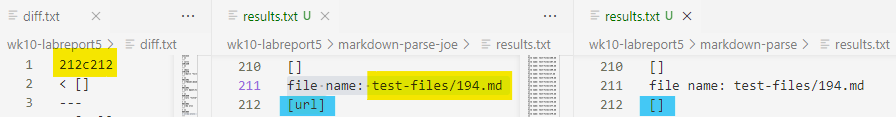

# Week 10 - Lab Report 5
## ***DIFFERENCES IN `MARKDOWN-PARSE`***

#### In this lab, you will examine the difference between the provided implementation from lab 9 and your `markdown-parse` code for two tests from the 652 commonmark-spec tests.
---
### **Locating Tests With Different Results**
1. In a new directory on my `ieng6` account, I cloned [my repository](https://github.com/aliu104/markdown-parse) and the [implementation provided for lab 9](https://github.com/ucsd-cse15l-w22/markdown-parse).

2. Next, I went into both of these two repositories' `script.sh` files and ensured that running the bash for both implementations would execute `MarkdownParse` for every case in the `test-files` directory and output results in the same format.

3. For each repository, I then ran the bash script, saving the output in a file called `results.txt`.

4. Ensuring that my command terminal is outside the two repositories, I used `diff` to compare the `results.txt` from the two files. I stored these differences in a file called `diff.txt`.

--
### **Commonmark-spec Tests: `test-files/194.md`**
Looking at the `diff.txt` file, I found variations between the result from my code and that of lab 9's implementation in the test file `194.md`.

The `diff.txt` file states that there are differences on line 212 of the two `results.txt` file. As shown in the screenshot above, lab 9's implementation extracted `url` as a link while my code did not extract any links.

According to *dillinger.io*, an online Markdown editor, test 194 should result in a link `title (with parens)`. Thus, neither of our implementations are correct. It appears that markdown has more than one way to generate links. In this case, links are whatever is between single quotes, which are in between "tags" indicating that this is an url (this is similar to html). 

Our codes only accounts for the format of a pair of brackets, followed immediately by a pair of parentheses, which creates the bug. In order to fix this bug for both codes, we would need to add more code checking for this alternative case. In the screenshot of lab 9's code above, we could potentially call a new method that checks for this alternative case right before the line highlighted. If there are no tags present, we exit the new method and proceed with our previous code from `getLinks`.

--
### **Commonmark-spec Tests: `test-files/481.md`**
Looking at the `diff.txt` file, I found variations between the result from my code and that of lab 9's implementation in the test file `481.md`.

The `diff.txt` file states that there are differences on line 850 of the two `results.txt` file. As shown in the screenshot above, lab 9's implementation did not extracted any links while my code extracted `/uri "title"`.

Once again, *dillinger.io* shows that test 481 should result in a link `title`. Thus, neither of our implementations are correct. Once again, Markdown seems to have special ways to indicate that a link is present. In this case, Markdown does follow the familiar format of a pair of brackets and then immediately a pair of parentheses. However, Markdown seems to ignore any text outside of the quotations within the parentheses. 

For my implementation, the bug is that for a pair of brackets and parentheses that are properly placed, indicating that a link is present, anything within the parentheses would be the link (no matter what is inside). To fix this, right before the highlighted section where I am adding the extracted link to the ArrayList, I could add more code looking for whether quotations are present in the substring, and if so, I would only extract and add links from within the quotes to the ArrayList.